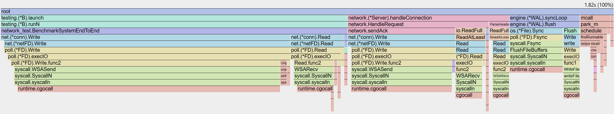
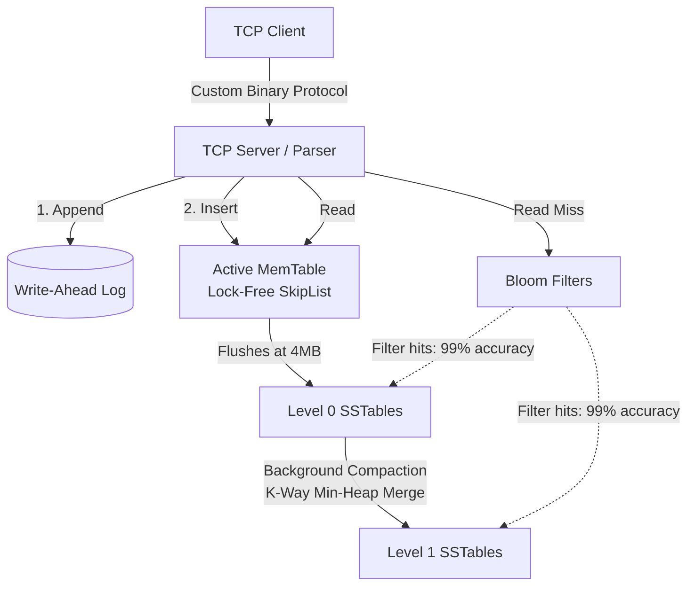

# Forest: High-Throughput LSM-Tree Storage Engine

[](https://github.com/Awesome06/Forest_DatabaseEngine/actions)
[](https://golang.org)
[](https://opensource.org/licenses/MIT)

Forest is a persistent, write-optimized distributed key-value store built entirely from scratch in Go. Designed for high write concurrency and sub-millisecond latencies, it leverages a Log-Structured Merge-Tree (LSM-Tree) architecture served over a raw, zero-allocation TCP binary socket. 

## Design Philosophy: Why Forest?
Most modern applications rely on high-level databases without understanding the mechanical sympathy required to make them fast. I built Forest to bridge the gap between application logic and kernel-level hardware execution. The primary goals of this project were to:
1. **Master Lock-Free Concurrency:** Eliminate mutex bottlenecks using atomic pointer swaps in a custom SkipList.
2. **Defeat Garbage Collection:** Prove that Go can handle extreme network throughput without stop-the-world GC pauses by engineering a zero-allocation hot path.
3. **Understand Disk I/O:** Implement Read-Copy-Update (RCU) file manifests and background compaction to manage disk fragmentation mathematically.

---

## Performance: The Zero-Allocation Hot Path

High-level HTTP/REST APIs generate massive amounts of heap allocations, triggering Go's Garbage Collector. Forest circumvents this via a custom TCP binary parser that reads headers directly from OS socket buffers.

**Parser Benchmark (Zero-Copy):**
```text
goos: windows / linux
goarch: amd64
pkg: [github.com/Forest_DatabaseEngine/internal/network](https://github.com/Forest_DatabaseEngine/internal/network)
cpu: 13th Gen Intel(R) Core(TM) i5-13450HX
BenchmarkParseHeader-16   206667542   5.822 ns/op   0 B/op   0 allocs/op
```
*Result: `5.8ns` parsing latency with **zero heap allocations** per request, allowing the engine to sustain massive throughput without triggering GC pauses.*

**CPU Profiling (pprof):**



*The flame graph above demonstrates the engine under heavy concurrent write load. Notice the complete absence of `mallocgc` (Garbage Collection) blocks on the TCP read/write paths, and the heavily isolated `engine.(*WAL).syncLoop` handling disk persistence entirely asynchronously.*

---

## System Architecture



## Core Features
*   **Lock-Free MemTable:** Uses a concurrent SkipList and Go's `sync/atomic` primitives to eliminate thread contention under heavy write load.
*   **Crash-Safe Durability:** Implements Write-Ahead Logging (WAL) with double-buffering. Ensures zero data loss up to the last network ACK.
*   **Disk-Optimized SSTables:** Append-only Sorted String Tables featuring integrated custom Bloom Filters (bit arrays) to mathematically eliminate disk reads for non-existent keys.
*   **RCU Compaction:** A dedicated background worker pool merges Level-0 files into sorted Level-1 files asynchronously. Uses Read-Copy-Update (RCU) reference counting so TCP reads never block during file deletions.

---

## Custom Binary Protocol Specification

To maximize throughput, Forest uses a strict 8-byte header followed by a variable payload.

| Field | Size | Description |
| :--- | :--- | :--- |
| **Magic Byte** | 1 Byte | Validation byte (`0xA1`) to reject malformed packets. |
| **OpCode** | 1 Byte | Operation type: `0x01` (GET), `0x02` (SET), `0x03` (DEL). |
| **Key Length** | 2 Bytes | Unsigned 16-bit integer defining key size. |
| **Value Length**| 4 Bytes | Unsigned 32-bit integer defining payload size. |
| **Payload** | Variable| Raw bytes containing `Key + Value`. |

---

## Getting Started & Chaos Testing

Forest is built to survive catastrophic failure. You can run the Chaos Engineering suite on your local machine to watch the database recover from an abrupt `kill -9` process termination.

### 1. Prerequisites
* Go 1.22+
* Linux/macOS recommended (Windows supported via WSL)

### 2. Run the Chaos Test
This script compiles the server, blasts it with concurrent writes, abruptly kills the process, and validates that the WAL recovers 100% of the acknowledged data on reboot.

```bash
git clone [https://github.com/Awesome06/Forest_DatabaseEngine.git](https://github.com/Awesome06/Forest_DatabaseEngine.git)
cd Forest_DatabaseEngine
chmod +x ./scripts/chaos_test.sh
./scripts/chaos_test.sh
```

### 3. Run the Server Manually
```bash
go build -o bin/forest ./cmd/server
./bin/forest --port=9000 --wal-dir=./data/wal --sst-dir=./data/sst
```

---

## Author
**Mrigank Bhatnagar** 
* GitHub: [@Awesome06](https://github.com/Awesome06)
* Connect regarding distributed systems, data engineering, and backend infrastructure.