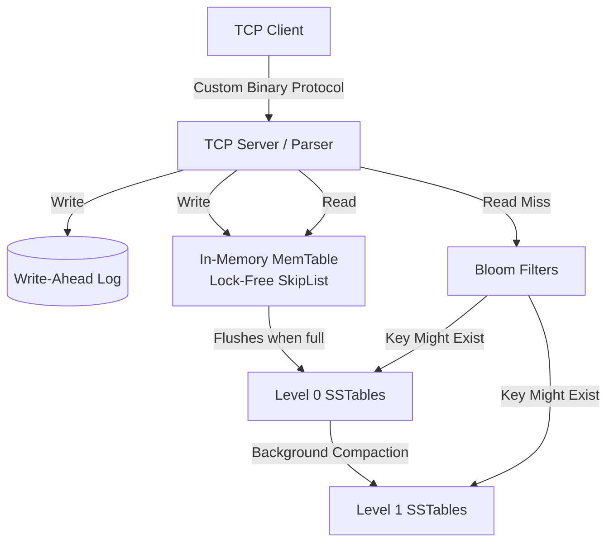

# Forest: High-Throughput LSM-Tree Storage Engine

[](https://github.com/Awesome06/forest/actions)
[](https://golang.org)
[](https://opensource.org/licenses/MIT)

Forest is a persistent, write-optimized distributed key-value store built entirely from scratch in Go. Designed for high write concurrency and sub-millisecond p99 latencies, it leverages a Log-Structured Merge-Tree (LSM-Tree) architecture served over a raw, zero-allocation TCP binary socket. 

## Core Features

*   **Zero-Copy Network Protocol:** Bypasses high-level HTTP overhead with a custom binary TCP parser that reads packet headers directly from `net.Conn` buffers without heap allocations.
*   **Lock-Free MemTable:** Uses a concurrent SkipList and Go's `sync/atomic` primitives to eliminate thread contention under high write concurrency.
*   **Crash-Safe Durability:** Implements Write-Ahead Logging (WAL) with double-buffering. Ensures zero data loss up to the last network ACK.
*   **Disk-Optimized SSTables:** Append-only Sorted String Tables featuring integrated custom Bloom Filters (bit arrays) to eliminate disk I/O for non-existent keys.
*   **Background Compaction:** A dedicated goroutine worker pool merges Level-0 files into sorted Level-1 files asynchronously, preventing read-amplification without blocking incoming network I/O.

---

## System Architecture



## Custom Binary Protocol Specification

To maximize throughput and avoid garbage collection (GC) pauses in Go, Forest uses a strict, lightweight binary protocol instead of text-based formats like JSON or HTTP.

| Field | Size | Description |
| :--- | :--- | :--- |
| **Magic Byte** | 1 Byte | Validation byte (`0xA1`) to reject malformed packets immediately. |
| **OpCode** | 1 Byte | Operation type: `0x01` (GET), `0x02` (SET), `0x03` (DEL). |
| **Key Length** | 2 Bytes | Unsigned 16-bit integer defining the key length. |
| **Value Length** | 4 Bytes | Unsigned 32-bit integer defining the payload length. |
| **Payload** | Variable | Raw bytes containing `Key + Value`. |

---

## Getting Started

### Prerequisites
* Go 1.22 or higher
* Linux/macOS recommended for optimal file I/O performance.

### Build and Run

```bash
# Clone the repository
git clone [https://github.com/Awesome06/forest.git](https://github.com/Awesome06/forest.git)
cd forest

# Build the executable
go build -o bin/forest ./cmd/server

# Start the server (default port 8080)
./bin/forest --port=8080 --wal-dir=./data/wal --sst-dir=./data/sst
```

## QA & Chaos Testing

Forest is built with mechanical sympathy in mind. The system's fault tolerance and performance are mathematically proven using rigorous testing pipelines:

1. **Fuzzing (`go-fuzz`):** The network parser is continuously fuzzed to ensure malformed or malicious byte streams cannot cause panics, memory leaks, or unhandled states.
2. **Chaos Engineering (`kill -9`):** A custom bash test suite blasts the server with concurrent writes while randomly terminating the process. Upon reboot, the system verifies that the MemTable is reconstructed perfectly via the WAL with zero dropped ACKs.
3. **Race Detection:** Fully integrated with Go's `-race` detector in CI/CD pipelines.
4. **Benchmarking (YCSB):** Standardized against the Yahoo Cloud Serving Benchmark.
   * *See the `/benchmarks` directory for detailed p99 latency graphs comparing read-heavy vs. write-heavy workloads.*

---

## Author

**Mrigank Bhatnagar** 
* GitHub: [@Awesome06](https://github.com/Awesome06)
* Connect regarding distributed systems, data engineering, and backend infrastructure.
